<!-- ═══════════════════════════════════════════════════════════════════
     KAKASHI8121 · SRIHAREE R · AI × CODE × SYSTEMS
     Profile README — neon-red / black / Kakashi identity
     Assets live in /.assets (SVG banners, divider, Sharingan marks)
     ═══════════════════════════════════════════════════════════════════ -->

<!-- ▸ HERO — main banner, light/dark adaptive -->

  <picture>
    <source media="(prefers-color-scheme: dark)" srcset=".assets/hero-banner-dark.svg">
    
  </picture>

   

  
  

   

  

   

  
  
  

<!-- ▸ ABOUT -->
##  About

  <table>
    <tr>
      <td width="62%" valign="top">
        <h3 align="left">Sriharee R&nbsp;</h3>
        

          <b>B.Tech Artificial Intelligence &amp; Data Science</b> undergraduate at
          <a href="https://rec.edu.in" rel="noopener"><b>Rajalakshmi Engineering College</b></a>, Chennai. 
          I build <b>intelligent systems</b> where agentic AI, automation, and solid software engineering meet —
          from <b>Discord bot ecosystems</b> and <b>mobile applications</b> to scalable backends and AI-powered products.
          I care about architecture that survives real usage, tools that remove repetitive work,
          and shipping fast without shipping fragile.
        

        

          
          
          
          
          
          
        

         
        <!-- ▸ Developer identity card -->
        <table role="presentation">
          <tr><td align="left"><code>NAME&nbsp;&nbsp;&nbsp;&nbsp;&nbsp;&nbsp;&nbsp;&nbsp;&nbsp;&nbsp;&nbsp;&nbsp;&nbsp;</code></td><td align="left">Sriharee R</td></tr>
          <tr><td align="left"><code>ALIAS&nbsp;&nbsp;&nbsp;&nbsp;&nbsp;&nbsp;&nbsp;&nbsp;&nbsp;&nbsp;&nbsp;&nbsp;&nbsp;</code></td><td align="left">Kakashi</td></tr>
          <tr><td align="left"><code>ROLE&nbsp;&nbsp;&nbsp;&nbsp;&nbsp;&nbsp;&nbsp;&nbsp;&nbsp;&nbsp;&nbsp;&nbsp;&nbsp;&nbsp;</code></td><td align="left">AI &amp; Software Engineer</td></tr>
          <tr><td align="left"><code>EDUCATION&nbsp;&nbsp;&nbsp;&nbsp;&nbsp;&nbsp;&nbsp;&nbsp;</code></td><td align="left">B.Tech AI &amp; Data Science · Rajalakshmi Engineering College</td></tr>
          <tr><td align="left"><code>FOCUS&nbsp;&nbsp;&nbsp;&nbsp;&nbsp;&nbsp;&nbsp;&nbsp;&nbsp;&nbsp;&nbsp;&nbsp;&nbsp;</code></td><td align="left">AI × Automation × Mobile × Bots</td></tr>
          <tr><td align="left"><code>CURRENTLY_BUILDING&nbsp;</code></td><td align="left">Death Bot X — Discord bot ecosystem</td></tr>
        </table>
      </td>
      <td width="38%" align="center" valign="middle">
        
      </td>
    </tr>
    <tr>
      <td colspan="2" align="center">
        <i>"Copy a foundation, master the craft, then build systems no one has seen before."</i>
      </td>
    </tr>
  </table>

<!-- ▸ CURRENTLY BUILDING -->
##  Currently Building

  <table>
    <tr>
      <td align="center" width="17%" valign="middle">
          
        <b>Autonomous multi-step systems</b>
      </td>
      <td align="center" width="17%" valign="middle">
          
        <b>Workflows that run themselves</b>
      </td>
      <td align="center" width="17%" valign="middle">
          
        <b>Android · cross-platform tools</b>
      </td>
      <td align="center" width="17%" valign="middle">
          
        <b>Death Bot X ecosystem</b>
      </td>
      <td align="center" width="17%" valign="middle">
          
        <b>Scalable backend engineering</b>
      </td>
      <td align="center" width="17%" valign="middle">
          
        <b>Rapid prototypes under pressure</b>
      </td>
    </tr>
  </table>

<!-- ▸ TECH STACK -->
##  Tech Stack

  <b>LANGUAGES</b> 
  
    
  <b>AI / ML</b> 
  
    
  <b>BACKEND</b> 
  
    
  <b>MOBILE</b> 
  
    
  <b>FRONTEND</b> 
  
    
  <b>DATABASES</b> 
  
    
  <b>TOOLS / INFRASTRUCTURE</b> 
  
   
  
  
  
  
  

<!-- ▸ FEATURED PROJECTS -->
##  Featured Work

### ⚔️ DEATH BOT X

*Next-generation Discord bot ecosystem — scalable architecture, automation, moderation,
economy, music, AI, security, caching, databases, and community tools.*

 

  <table>
    <tr>
      <td width="50%" valign="top">
        <h3 align="center">🤖 Agentic AI Projects</h3>
        

          Multi-step agents with tool use, memory, and orchestration — designed as reliable systems rather
          than demo scripts, wired for real tasks and clean handoffs.
        

      </td>
      <td width="50%" valign="top">
        <h3 align="center">🧠 AI Applications</h3>
        

          AI-powered products that put models behind useful interfaces — applied intelligence with
          practical UX instead of lab-only experiments.
        

      </td>
    </tr>
    <tr>
      <td width="50%" valign="top">
        <h3 align="center">📱 Mobile Applications</h3>
        

          Android-first apps with clean state, smooth UX, and backends that stay fast under
          real device conditions.
        

      </td>
      <td width="50%" valign="top">
        <h3 align="center">⚙️ Automation Tools</h3>
        

          Bots, scripts, and pipelines that eliminate repetitive work — plus hands-on hardware
          experimentation such as a mic amplifier build.
        

      </td>
    </tr>
  </table>

<!-- ▸ GITHUB ANALYTICS -->
##  GitHub Analytics

  
  
    
  
    
  <picture>
    <source media="(prefers-color-scheme: dark)" srcset="https://github-readme-activity-graph.vercel.app/graph?username=kakashi8121&bg_color=0D1117&color=FFFFFF&line=FF2D2D&point=FFFFFF&area=true&area_color=8B0000&hide_border=true">
    
  </picture>

<!-- ▸ CONTRIBUTION SNAKE -->
##  Contribution Snake

  <picture>
    <source media="(prefers-color-scheme: dark)" srcset="https://raw.githubusercontent.com/kakashi8121/kakashi8121/output/github-contribution-grid-snake-dark.svg">
    
  </picture>

The snake is generated automatically on every push and schedule via GitHub Actions.

<!-- ▸ CONNECT -->
##  Connect

  
  
  
  

<!-- ▸ SIGNATURE — developer console -->

  <pre><code>SYSTEM STATUS
━━━━━━━━━━━━━━━━━━━━━━━━━━━━
 AI SYSTEMS ......... ONLINE
 CODE ............... ONLINE
 CREATIVITY ......... ONLINE
 BUILD MODE ......... ACTIVE
━━━━━━━━━━━━━━━━━━━━━━━━━━━━</code></pre>

<!-- ▸ FINAL QUOTE -->

  <b>FINAL TRANSMISSION</b>
  <h3><i>"Build what others only imagine — then make it run in production."</i></h3>

<!-- ▸ FOOTER -->

  
    
  
    <b>SRIHAREE R · KAKASHI</b>&nbsp;·&nbsp;
    <a href="https://github.com/kakashi8121">GitHub</a>&nbsp;·&nbsp;
    <a href="https://www.linkedin.com/in/sriharee-r-820016425">LinkedIn</a>&nbsp;·&nbsp;
    <a href="https://www.instagram.com/sriharee.r">Instagram</a>&nbsp;·&nbsp;
    <a href="mailto:sriharee.r.2025.aids@rajalakshmi.edu.in">Email</a>
  

